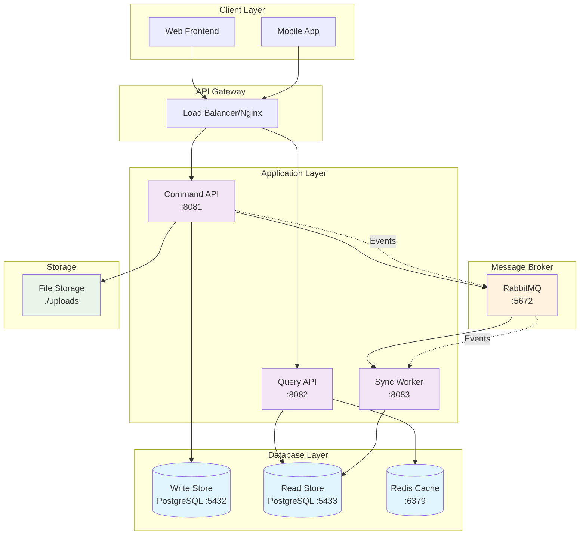
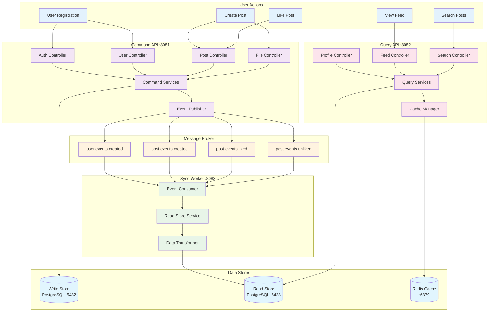
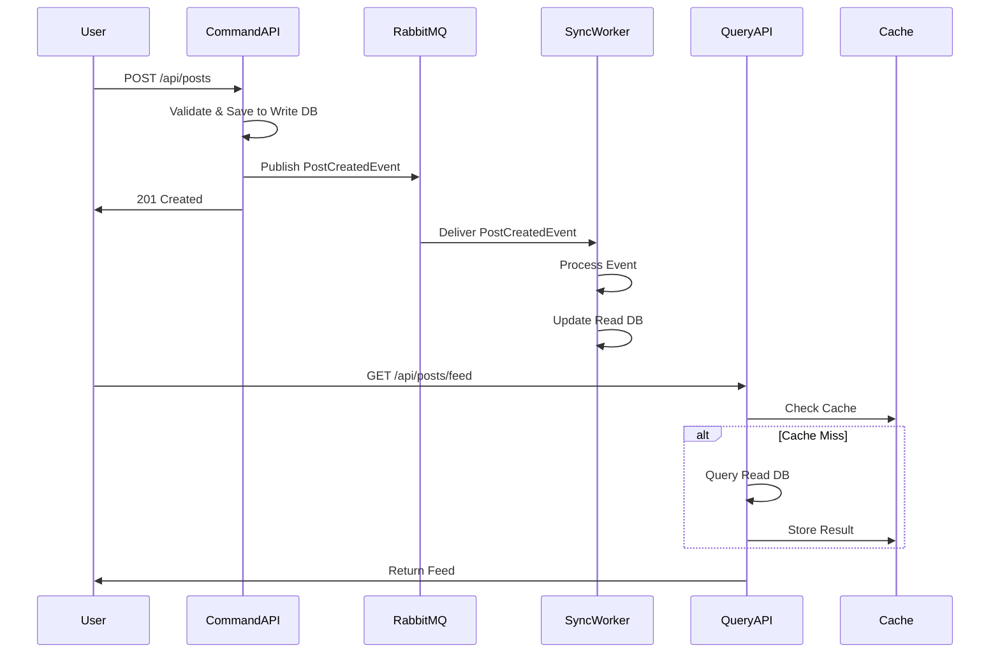

# Puppies Social Network - CQRS Architecture

A modern social media platform built with **CQRS (Command Query Responsibility Segregation)** pattern, optimized for high read throughput typical of social networks.

## 🏗️ Architecture Overview

This project implements a complete CQRS architecture with event-driven synchronization between write and read stores, designed specifically for social media workloads where reads vastly outnumber writes.

### Key Design Decisions

- **Separate Read/Write Databases**: Optimized data models for different use cases
- **Event-Driven Architecture**: Asynchronous communication via RabbitMQ
- **Intelligent Caching**: Redis-based caching with user behavior analysis
- **Microservices**: Independent, scalable services with clear responsibilities

## 📊 Architecture Diagram



## 🎯 Core Components

### 1. Command API (Write Side) - Port 8081

**Responsibility**: Handles all write operations (create, update, delete)

- **Database**: PostgreSQL Write Store (normalized schema)
- **Features**:
  - User registration and authentication
  - Post creation with image upload
  - Like/Unlike operations
  - JWT-based security
  - Domain event publishing

**Key Endpoints**:
- `POST /api/users` - Create user
- `POST /api/auth/login` - User authentication
- `POST /api/posts` - Create post
- `POST /api/posts/{id}/like` - Like post

### 2. Query API (Read Side) - Port 8082

**Responsibility**: Handles all read operations with optimized performance

- **Database**: PostgreSQL Read Store (denormalized schema)
- **Cache**: Redis with intelligent caching strategies
- **Features**:
  - User profile queries
  - Post feed generation
  - Search and filtering
  - Real-time metrics (likes, comments, views)
  - User behavior analysis for cache optimization

**Key Endpoints**:
- `GET /api/users/{id}/profile` - User profile
- `GET /api/posts/feed` - User feed
- `GET /api/posts/{id}` - Post details
- `GET /api/posts/search` - Search posts

### 3. Sync Worker - Port 8083

**Responsibility**: Synchronizes data from Write Store to Read Store

- **Pattern**: Event-driven data synchronization
- **Message Broker**: RabbitMQ
- **Features**:
  - Handles domain events from Command API
  - Updates denormalized read store
  - Maintains data consistency
  - Error handling and retry mechanisms

**Event Handlers**:
- `PostCreatedEvent` → Create denormalized post record
- `PostLikedEvent` → Update like counters
- `UserCreatedEvent` → Create user profile projection

## 🗄️ Database Architecture

### Write Store (PostgreSQL - Port 5432)
**Purpose**: Optimized for write operations and data consistency

```sql
-- Normalized schema example
CREATE TABLE users (
    id SERIAL PRIMARY KEY,
    username VARCHAR(50) UNIQUE NOT NULL,
    email VARCHAR(100) UNIQUE NOT NULL,
    password_hash VARCHAR(255) NOT NULL,
    created_at TIMESTAMP DEFAULT CURRENT_TIMESTAMP
);

CREATE TABLE posts (
    id SERIAL PRIMARY KEY,
    author_id INTEGER REFERENCES users(id),
    image_url VARCHAR(500) NOT NULL,
    text_content TEXT,
    created_at TIMESTAMP DEFAULT CURRENT_TIMESTAMP
);

CREATE TABLE likes (
    id SERIAL PRIMARY KEY,
    user_id INTEGER REFERENCES users(id),
    post_id INTEGER REFERENCES posts(id),
    created_at TIMESTAMP DEFAULT CURRENT_TIMESTAMP,
    UNIQUE(user_id, post_id)
);
```

### Read Store (PostgreSQL - Port 5433)
**Purpose**: Optimized for read operations and query performance

```sql
-- Denormalized schema example
CREATE TABLE read_posts (
    id BIGINT PRIMARY KEY,
    author_id BIGINT NOT NULL,
    author_name VARCHAR(50) NOT NULL,
    content TEXT,
    image_url VARCHAR(500) NOT NULL,
    like_count BIGINT DEFAULT 0,
    comment_count BIGINT DEFAULT 0,
    view_count BIGINT DEFAULT 0,
    popularity_score DOUBLE PRECISION DEFAULT 0.0,
    created_at TIMESTAMP NOT NULL,
    updated_at TIMESTAMP DEFAULT CURRENT_TIMESTAMP
);

CREATE TABLE read_user_profiles (
    id BIGINT PRIMARY KEY,
    username VARCHAR(50) NOT NULL,
    email VARCHAR(100) NOT NULL,
    bio TEXT,
    profile_image_url VARCHAR(500),
    posts_count BIGINT DEFAULT 0,
    followers_count BIGINT DEFAULT 0,
    following_count BIGINT DEFAULT 0,
    created_at TIMESTAMP NOT NULL
);
```

## 🚀 Why CQRS for Social Media?

### Read/Write Patterns in Social Media
- **Read Operations**: 90-95% of requests (feeds, profiles, search)
- **Write Operations**: 5-10% of requests (posts, likes, comments)

### Benefits Achieved
1. **Independent Scaling**: Scale read and write services independently
2. **Optimized Data Models**: Different schemas for different access patterns
3. **Performance**: Read store optimized for complex queries with pre-calculated metrics
4. **Caching Strategy**: Intelligent caching based on user behavior patterns
5. **Reliability**: Write operations don't affect read performance

## 🔧 Technology Stack

| Component | Technology | Purpose |
|-----------|------------|---------|
| **Backend Framework** | Spring Boot 3.x | REST APIs, dependency injection |
| **Write Database** | PostgreSQL 15 | ACID compliance, normalized data |
| **Read Database** | PostgreSQL 15 | Optimized queries, denormalized data |
| **Message Broker** | RabbitMQ | Event-driven communication |
| **Cache** | Redis | Query optimization, session storage |
| **Security** | JWT + Spring Security | Authentication and authorization |
| **Database Migration** | Flyway | Version-controlled schema changes |
| **File Storage** | Local File System | Image uploads (configurable) |
| **Monitoring** | Spring Actuator | Health checks and metrics |

## 🏃‍♂️ Getting Started

### Prerequisites
- Java 17+
- Maven 3.6+
- Docker & Docker Compose

### 1. Start Infrastructure
```bash
cd puppies-ecosystem
docker-compose up -d
```

This starts:
- PostgreSQL Write Store (port 5432)
- PostgreSQL Read Store (port 5433)
- Redis (port 6379)
- RabbitMQ (port 5672, management UI: 15672)

### 2. Start Applications

**Terminal 1 - Command API:**
```bash
cd puppies-command-api
mvn spring-boot:run
```

**Terminal 2 - Query API:**
```bash
cd puppies-query-api
mvn spring-boot:run
```

**Terminal 3 - Sync Worker:**
```bash
cd puppies-sync-worker
mvn spring-boot:run
```

### 3. Verify Setup
- Command API: http://localhost:8081/swagger-ui.html
- Query API: http://localhost:8082/swagger-ui.html
- RabbitMQ Management: http://localhost:15672 (guest/guest)

## 📚 API Documentation

### Authentication Flow
1. Register user via Command API: `POST /api/users`
2. Login via Command API: `POST /api/auth/login`
3. Use JWT token for protected endpoints

### Example Workflow
```bash
# 1. Create user
curl -X POST http://localhost:8081/api/users \
  -H "Content-Type: application/json" \
  -d '{"username":"john","email":"john@example.com","password":"password123"}'

# 2. Login
curl -X POST http://localhost:8081/api/auth/login \
  -H "Content-Type: application/json" \
  -d '{"email":"john@example.com","password":"password123"}'

# 3. Create post (with JWT token)
curl -X POST http://localhost:8081/api/posts \
  -H "Authorization: Bearer <JWT_TOKEN>" \
  -F "image=@dog.jpg" \
  -F "textContent=My cute puppy!"

# 4. Get user feed (optimized read)
curl -X GET http://localhost:8082/api/posts/feed \
  -H "Authorization: Bearer <JWT_TOKEN>"
```

## 🧪 Testing Strategy

### Unit Tests
- Service layer logic
- Event handling
- Cache strategies

### Integration Tests
- API endpoints
- Database operations
- Message queue processing

### Load Testing
- Read/write performance comparison
- Cache hit rates
- Event processing latency

## 🔄 Data Flow Architecture

### Complete System Flow


### Event Processing Sequence


## 📈 Performance Optimizations

### Read Store Optimizations
- **Denormalized Data**: Pre-calculated counters (likes, comments, views)
- **Optimized Indexes**: Query-specific database indexes
- **Intelligent Caching**: User behavior-based cache strategies

### Cache Strategies
- **Hot Posts Cache**: Frequently accessed posts
- **User Behavior Cache**: Personal recommendations
- **Feed Cache**: Pre-calculated user feeds

## 🏗️ Module Structure

```
puppies-ecosystem/
├── puppies-command-api/     # Write operations
├── puppies-query-api/       # Read operations  
├── puppies-sync-worker/     # Data synchronization
├── docker-compose.yml       # Infrastructure
└── README.md               # This file
```

Each module has its own:
- `README.md` - Specific setup instructions
- `Makefile` - Common development tasks
- `monitoring/` - Grafana dashboards

## 🔧 Configuration

### Environment Variables
- `DB_WRITE_HOST`: Write database host
- `DB_READ_HOST`: Read database host
- `REDIS_HOST`: Redis cache host
- `RABBITMQ_HOST`: Message broker host
- `JWT_SECRET`: JWT signing secret
- `FILE_UPLOAD_DIR`: File storage directory

### Profiles
- `default`: Local development
- `test`: Unit/integration tests
- `prod`: Production configuration

## 🚀 Deployment

### Local Development
All services run locally with Docker infrastructure

### Production Considerations
- **Database**: Managed PostgreSQL (AWS RDS, Azure Database)
- **Message Broker**: Managed RabbitMQ (CloudAMQP, Amazon MQ)
- **Cache**: Managed Redis (AWS ElastiCache, Azure Cache)
- **File Storage**: Cloud storage (AWS S3, Azure Blob)
- **Load Balancer**: Nginx, AWS ALB, or Azure Load Balancer

## 📊 Monitoring & Observability

- **Health Checks**: Spring Actuator endpoints
- **Metrics**: Custom metrics for cache hit rates, event processing
- **Logging**: Structured logging with correlation IDs
- **Grafana Dashboards**: Pre-configured monitoring dashboards

## 🤝 Contributing

1. Follow the established CQRS patterns
2. Maintain clear separation between read and write concerns
3. All new features should include appropriate tests
4. Update documentation for API changes

## 📝 License

This project is licensed under the MIT License - see the LICENSE file for details.