# Puppies Sync Worker

The **Sync Worker** is the critical component that maintains data consistency between the write and read stores in the CQRS architecture. It processes domain events and updates the denormalized read database.

## 🎯 Responsibilities

- Listen to domain events from Command API via RabbitMQ
- Transform normalized data to denormalized read models
- Update read store with optimized data structures
- Maintain data consistency across stores
- Handle event processing failures and retries

## 🚀 Quick Start

### Prerequisites
- Java 17+
- Maven 3.6+
- Running infrastructure (see main README)
- Command API running (for event generation)

### Running the Service

```bash
# From puppies-ecosystem directory
cd puppies-sync-worker

# Install dependencies and run
mvn clean install
mvn spring-boot:run
```

The service will start on **http://localhost:8083**

## 🔧 Configuration

### Database Connection
```yaml
spring:
  datasource:
    url: jdbc:postgresql://localhost:5433/puppies_read
    username: admin
    password: admin123
```

### Message Broker
```yaml
spring:
  rabbitmq:
    host: localhost
    port: 5672
    username: guest
    password: guest
```

### Key Features
- **Port**: 8083
- **Database**: PostgreSQL Read Store (port 5433)
- **Message Source**: RabbitMQ event queues
- **Pattern**: Event-driven data synchronization

## 📨 Event Processing

### Supported Events

| Event Type | Queue | Handler | Description |
|------------|-------|---------|-------------|
| `PostCreatedEvent` | `puppies.post.created.queue` | `handlePostCreated()` | Creates denormalized post record |
| `PostLikedEvent` | `puppies.post.liked.queue` | `handlePostLiked()` | Updates like counters |
| `PostUnlikedEvent` | `puppies.post.unliked.queue` | `handlePostUnliked()` | Updates like counters |
| `UserCreatedEvent` | `puppies.user.created.queue` | `handleUserCreated()` | Creates user profile projection |

### Event Flow Example

```mermaid
sequenceDiagram
    participant CMD as Command API
    participant RMQ as RabbitMQ
    participant SYNC as Sync Worker
    participant READ as Read Store

    CMD->>RMQ: Publish PostCreatedEvent
    RMQ->>SYNC: Deliver Event
    SYNC->>SYNC: Process Event
    SYNC->>READ: Insert Denormalized Post
    SYNC->>READ: Update User Post Count
    Note over SYNC: Event processed ✅
```



## 🔄 Data Transformation

### Post Creation Example
```java
@RabbitListener(queues = "puppies.post.created.queue")
public void handlePostCreated(PostCreatedEvent event) {
    // Transform normalized data to denormalized read model
    ReadPost readPost = ReadPost.builder()
        .id(event.getPostId())
        .authorId(event.getAuthorId())
        .authorName(event.getAuthorName())
        .content(event.getContent())
        .imageUrl(event.getImageUrl())
        .likeCount(0L)
        .commentCount(0L)
        .viewCount(0L)
        .popularityScore(0.0)
        .createdAt(event.getCreatedAt())
        .build();
    
    readPostRepository.save(readPost);
}
```

### Denormalization Benefits
- **Performance**: Pre-calculated counters and metrics
- **Query Optimization**: Data structured for common access patterns
- **Reduced Joins**: All related data in single tables

## 🗄️ Read Store Schema

### Read Posts Table
```sql
CREATE TABLE read_posts (
    id BIGINT PRIMARY KEY,
    author_id BIGINT NOT NULL,
    author_name VARCHAR(50) NOT NULL,        -- Denormalized
    content TEXT,
    image_url VARCHAR(500) NOT NULL,
    like_count BIGINT DEFAULT 0,             -- Pre-calculated
    comment_count BIGINT DEFAULT 0,          -- Pre-calculated
    view_count BIGINT DEFAULT 0,             -- Pre-calculated
    popularity_score DOUBLE PRECISION,       -- Calculated metric
    created_at TIMESTAMP NOT NULL,
    updated_at TIMESTAMP DEFAULT CURRENT_TIMESTAMP
);
```

### Feed Items Table
```sql
CREATE TABLE read_feed_items (
    id BIGINT PRIMARY KEY,
    user_id BIGINT NOT NULL,                 -- Feed owner
    post_id BIGINT NOT NULL,
    post_author_id BIGINT NOT NULL,
    post_content TEXT,
    post_image_url VARCHAR(500),
    like_count BIGINT DEFAULT 0,
    created_at TIMESTAMP NOT NULL,
    feed_priority INTEGER DEFAULT 0          -- Ranking algorithm
);
```

## 🧪 Testing

```bash
# Run unit tests
mvn test

# Test event processing
mvn test -Dtest=EventConsumerTest

# Integration tests with RabbitMQ
mvn test -Dtest=**/*IntegrationTest
```

### Manual Event Testing
```bash
# Send test event via RabbitMQ Management UI
# URL: http://localhost:15672
# Queue: puppies.post.created.queue
# Payload:
{
  "eventId": "test-123",
  "eventType": "POST_CREATED",
  "postId": 1,
  "authorId": 1,
  "authorName": "John Doe",
  "content": "Test post",
  "imageUrl": "http://example.com/image.jpg",
  "createdAt": "2024-01-15T10:00:00"
}
```

## 🔍 Monitoring

### Health Checks
- Application: http://localhost:8083/actuator/health
- Database: http://localhost:8083/actuator/health/db
- RabbitMQ: http://localhost:8083/actuator/health/rabbit

### Event Processing Metrics
```bash
# Check processing statistics
curl http://localhost:8083/actuator/metrics/rabbitmq.consumed

# Check error rates
curl http://localhost:8083/actuator/metrics/rabbitmq.failed
```

### RabbitMQ Monitoring
- Management UI: http://localhost:15672 (guest/guest)
- Queue status: Check message rates and queue depths
- Dead letter queues: Monitor failed message processing

## 📁 Project Structure

```
src/main/java/com/puppies/sync/
├── consumer/           # RabbitMQ event consumers
├── service/           # Data transformation logic
├── repository/        # Read store repositories
├── model/            # Read-optimized models
├── event/            # Event DTOs
└── config/           # RabbitMQ configuration
```

## 🐛 Troubleshooting

### Common Issues

1. **Events Not Being Consumed**
   ```bash
   # Check RabbitMQ connection
   docker logs puppies-rabbitmq
   
   # Check queue bindings
   curl -u guest:guest http://localhost:15672/api/queues
   ```

2. **Database Connection Errors**
   ```bash
   # Check read database
   docker ps | grep puppies-postgres-read
   
   # Test connection
   psql -h localhost -p 5433 -U admin -d puppies_read
   ```

3. **Event Processing Failures**
   ```bash
   # Check application logs
   docker logs puppies-sync-worker
   
   # Check dead letter queues
   curl -u guest:guest http://localhost:15672/api/queues/%2F/dlq.puppies.post.created
   ```

### Performance Issues

1. **Slow Event Processing**
   ```yaml
   # Increase consumer concurrency
   spring:
     rabbitmq:
       listener:
         simple:
           concurrency: 5
           max-concurrency: 10
   ```

2. **Database Bottlenecks**
   ```sql
   -- Add indexes for common queries
   CREATE INDEX idx_read_posts_author_created 
   ON read_posts(author_id, created_at DESC);
   ```

## 🔧 Configuration Options

### Event Retry Configuration
```yaml
spring:
  rabbitmq:
    listener:
      simple:
        retry:
          enabled: true
          initial-interval: 1000ms
          max-attempts: 3
          multiplier: 2.0
```

### Database Pool Configuration
```yaml
spring:
  datasource:
    hikari:
      maximum-pool-size: 20
      minimum-idle: 5
      idle-timeout: 300000
```

## 🚀 Deployment Considerations

### Production Settings
- **Resource Allocation**: Adequate memory for event buffering
- **Database Connections**: Optimal connection pool sizing
- **Monitoring**: Comprehensive logging and alerting
- **Error Handling**: Dead letter queue configuration

### Scaling
- **Horizontal**: Multiple worker instances with shared queues
- **Queue Partitioning**: Separate queues for different event types
- **Database Sharding**: Read store partitioning for large datasets

## 📊 Performance Benchmarks

| Metric | Target | Monitoring |
|--------|--------|------------|
| Event Processing Time | < 100ms | Actuator metrics |
| Queue Depth | < 1000 messages | RabbitMQ management |
| Database Write Latency | < 50ms | Application logs |
| Error Rate | < 1% | Dead letter queues |